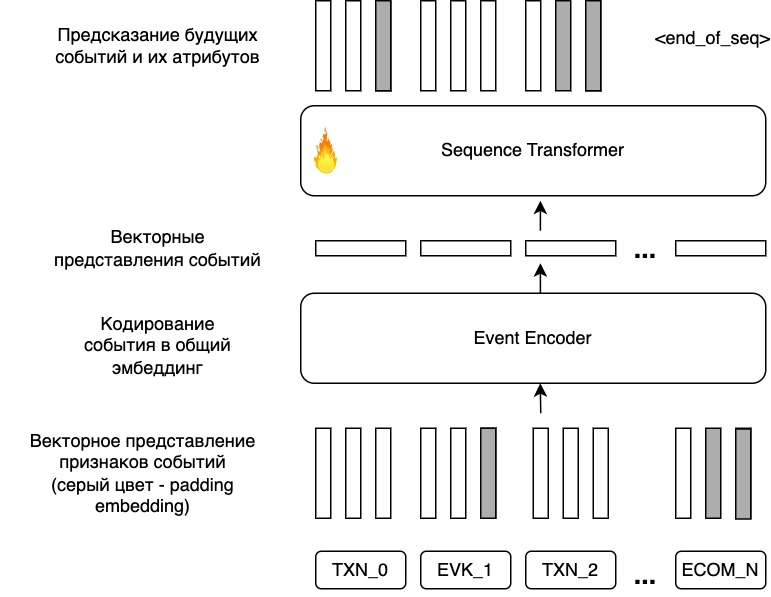

# Next Event Prediction

  
---
  
## Навигация
* `next_event_prediction.ipynb` - сбор и подготовка данных для обучения
* `configs/ssl.yaml` - конфигурация для обучения в next event prediction
* `download_data.sh` - скрипт подгрузки данных из РХ.
  
---
  
## Запуск обучения
```bash
chmod +x download_data.sh
./download_data.sh
```
  
```bash
torchrun --standalone --nproc_per_node=1 -m avatar.train --config-dir=configs/ --config-name=ssl
```

## Запуск инференса
```
python -m avatar.infer --config-dir=configs --config-name=inference
```
По итогу будут сохранены `.parquet` файлы, которые будут содержать следующие поля:
* epk_id - идентификатор клиента
* seq_hidden_state - эмбеддинг клиента
Если необходимо сохранять дополнительные поля, укажите список колонок в `metrics.test_metrics.additional_columns`.