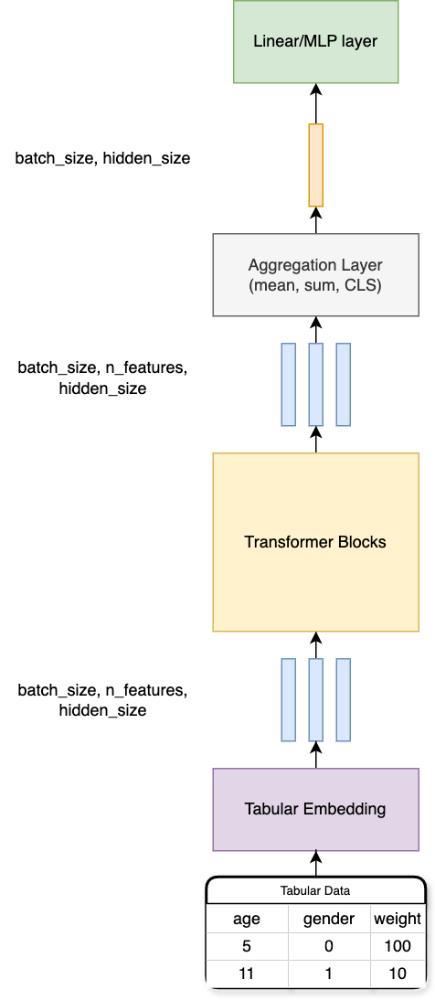
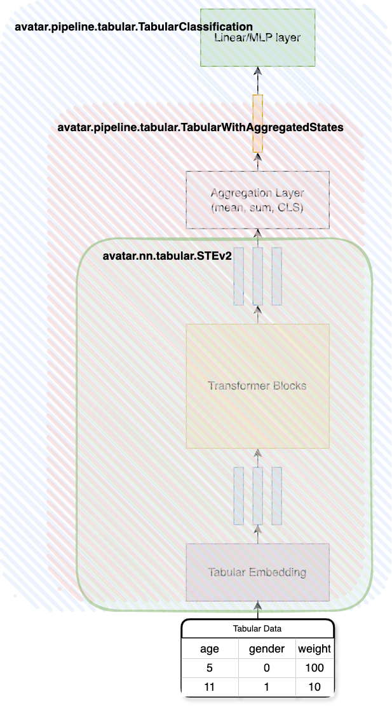
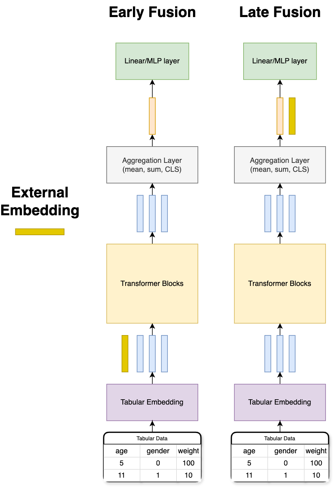

# Обучение табличной нейросетевой модели, используя внешние эмбеддинги
## Выгрузка данных
В ноутбуке `td_data_collection.ipynb` - скрипт сборки данных для обучения. Для удобства они уже есть в РХ, поэтому их можно выгрузить следующим образом:
```bash
kinit
chmod +x download_data.sh
./download_data.sh
```

## Настройка конфигов
После выгрузки данных из РХ необходимо указать абсолютные пути до данных в каждом файле конфигурации, которые лежат в `configs/*.yaml`.

## Теоретическая часть
### Tabular Transformer
В качестве табличной модели мы будем использовать адаптированную под табличные данные архитектуру Transformer encoder-only (`avatar.nn.tabular.STEv2`).
  
Основные блоки архитектуры:
* Embedding Layer - отображает табличные признаки в векторное пространство. Пример реализации: `avatar.nn.embedding.TabularEmbedding`
* Transformer Block - классический трансформер блок с multi-head-self-attn, ffn, add & norm. Пример реализации: `avatar.nn.tabular.STEv2Body`
  
---
  
Обозначения:
* hidden_states - скрытые состояния из трансформера
* batch_size (B)- размер батча
* n_features (N) - количество входных признаков
* hidden_size (D) - размерность эмбеддингов
  
Выходной тензор из Embedding Layer имеет размерность B, N, D. Transformer блок на выходе не изменяет размерность входного тензора, поэтому она будет такой же: B, N, D.

  
### Hidden State Aggregation
Если мы хотим решать задачу классификации/регрессии на основе скрытых состояний, необходимо выполнить агрегацию hidden_states, например: `B, N, D -> B, D`. Для этого можно использовать операцию суммы, среднего, добавлять нормализацию, обучаемые параметры, добавлять `CLS` токен и так далее, а для downstream задачи использовать только его эмбеддинг. В пайплайне реализованы базовые методы агрегации; их реализации находятся здесь: `avatar.nn.utils.agg.py`.
  
После агрегации эмбеддингов мы можем применить nn.Linear(D, n_classes), где n_classes - это количество классов в случае задачи классификации.

### Tabular Classification

  
В реализации пайплайна по возможности все разделено на модули, что дает больше гибкости при разработке и проведении экспериментов. Предлагаю рассмотреть это на инциализации модуля `avatar.pipeline.tabular.TabularClassification`, используя hydra config:
  
```yaml
model:
  _target_: avatar.pipeline.tabular.TabularClassification
  model:
    _target_: avatar.pipeline.tabular.TabularWithAggregatedStates
    backbone:
      _target_: avatar.nn.tabular.STEv2
      embedding:
        _target_: avatar.nn.embedding.TabularEmbedding
        num_numerical_features: 189
        hidden_size: 64
        vocab_size: 172
        std_noise: null
      num_heads: 4
      num_layers: 3
      attn_dropout: 0.15
    aggregation_config:
      name: linear
      num_features: 243
      emb_dim: ${model.model.backbone.embedding.hidden_size}
  num_classes: 2
  dropout_p: 0.15
  task_type: classification
```
  
Основные модули:
* `avatar.nn.tabular.STEv2` - Табличный трансформер (Embedding Layer + Transformer Block layers). В качестве Embedding layer используется `avatar.nn.embedding.TabularEmbedding` - Embedding Layer. STEv2 является дочерним классом для `avatar.nn.tabular.BaseTabularBackbone`.
* `avatar.nn.TabularWithAggregatedStates` - Модуль, оборачивает BaseTabularBackbone и добавляет слой агрегации, который можно реализовать самостоятельно, основываясь на `avatar.nn.utils.agg.BaseAggregation`, или использовать существущие.
* `avatar.pipeline.tabular.TabularClassification` - используя агрегированный hidden_state из TabularWithAggregatedStates, добавляет слой проекции из hiden_state_dim -> n_classes и рассчитывает значение функции потерь.
  

  
## Добавление external embedding
Если у нас есть некотрый эмбеддинг клиента, который мы хотим добавить в нашу модель у нас есть множество способов как его добавить, вот два самых базовых из них:
1. Как новый признак к табличным признакам (Early Fusion)
2. Дополнительный вектор к вектору после агрегации в AggregationLayer (Late Fusion)
  

  
## Обучение моделей и сравнение подходов
**Для воспроизводимости результатов рекомендуем запускать обучение без multi-gpu**  
  
Теперь можно к сборке конфигов и запуску обучения, предлагаем следущие архитектурные эксперименты:
1. Without external hidden_states
```bash
torchrun --standalone --nproc_per_node=1 -m avatar.train --config-dir=configs --config-name=no_hidden
```
2. Early Fusion
```bash
torchrun --standalone --nproc_per_node=1 -m avatar.train --config-dir=configs --config-name=early_fusion
```
3. Late Fusion
```bash
torchrun --standalone --nproc_per_node=1 -m avatar.train --config-dir=configs --config-name=late_fusion
```
4. Early Fusion + Late Fusion
```bash
torchrun --standalone --nproc_per_node=1 -m avatar.train --config-dir=configs --config-name=early_late_fusion
```
  
## Логирование метрик и запуск mlflow
Все метрики в процессе обучения логируются в mlflow. Для запуска UI Mlflow необходимо выполнить следующее:
1. Запуск сервиса на локальной машине. Выполняется в директории, в который происходил запуск обучения, в ней будет папка ./mlruns.
```
mlflow ui --port 5000 --host 127.0.0.1 --default-artifact-root ./mlruns
```
2. Открыть MlFlow UI в браузере. Для этого необходимо перейти по ссылке:
```
# Нужно заменить `<YOUR_LOGIN>` на логин вашей учетной записи в формате 21937299
https://jupyterhub-datalab.apps.prom-datalab.ca.sbrf.ru/user/<YOUR_LOGIN>_omega-sbrf-ru/proxy/5000/
```

## Метрики на тестовой выборке
После обучения моделей были выбраны лучшие эпохи по метрике RocAuc на валидационной выборке. Для инференса тестовой выборки были составлены файлы конфигурации в папке `configs/inference`.
  
Пример конфига для инференса:
```yaml
load_state: /home/datalab/nfs/avatar_fm/examples/tabular_hidden_states/best_models/tabular_hidden_states/tabular_early_fusion/13/model.bin # Путь до весов
distributed:
  backend: null  # null -> nccl on GPU, gloo on CPU
  gradient_accumulation_steps: 1
amp: no  # no | fp16 | bf16
test_dataloader:
  _target_: torch.utils.data.DataLoader
  dataset:
    _target_: avatar.data.TabularDataset
    path: /home/datalab/nfs/avatar_fm/examples/tabular_hidden_states/data/td_processed/test # Путь до тестовой выборки
    shuffle_files: False
    shuffle_pq: False
    hidden_state_column: seq_hidden_state # название колонки с hidden_state
  batch_size: 2048
  pin_memory: True
  drop_last: False
  num_workers: 8
  collate_fn:
    _target_: avatar.data.TabularCollateFn
    target_column: target_attr_1
model:
  _target_: avatar.pipeline.tabular.TabularClassification
  model:
    _target_: avatar.pipeline.tabular.TabularWithAggregatedStates
    backbone:
      _target_: avatar.nn.tabular.STEv2
      embedding:
        _target_: avatar.nn.embedding.TabularEmbedding
        num_numerical_features: 189
        hidden_size: 64
        vocab_size: 172
        std_noise: null
        hidden_state_aggregator:
          _target_: avatar.nn.embedding.LayerNormConcatenate
          hidden_state_dim: 128
          embedding_dim: ${model.model.backbone.embedding.hidden_size} # Размерность на выходе из Tabular Embedding
      num_heads: 4
      num_layers: 3
      attn_dropout: 0.15
    aggregation_config:
      name: linear
      num_features: 244 
      emb_dim: ${model.model.backbone.embedding.hidden_size}
  num_classes: 2
  dropout_p: 0.15
  task_type: classification
metrics:
  test_metrics:
    _target_: avatar.metrics.ClassificationInferenceMetrics
    input_columns_to_save:
      - epk_id
      - targets
    path_to_save: predicts/early_fusion # Путь для сохранения
```
  
Пример запуска инференса:
```
python -m avatar.infer --config-dir=configs/inference --config-name=<pass_your_config_name>
```
В ноутбуке `metrics.ipynb` приведен код для расчета метрик.

|Подход|RocAucScore|
|------|-----------|
|Only tabular features| *0.8929|
|Early Fusion |0.8910|
|Late Fusion|**0.8931**|
|Late Early Fusion|0.8918|
